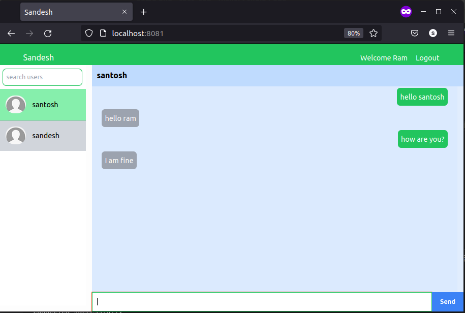

# Sandesh (chat app)

## About
A basic realtime chat application done to practise Typescript as well as socketIO.

## Tools Used
- Express library
- Typescript
- MongoDB & Mongoose
- Pug templating engine
- SocketIO

## Features
- Login/Register
- Search & connect with registered users
- chat with connected users

